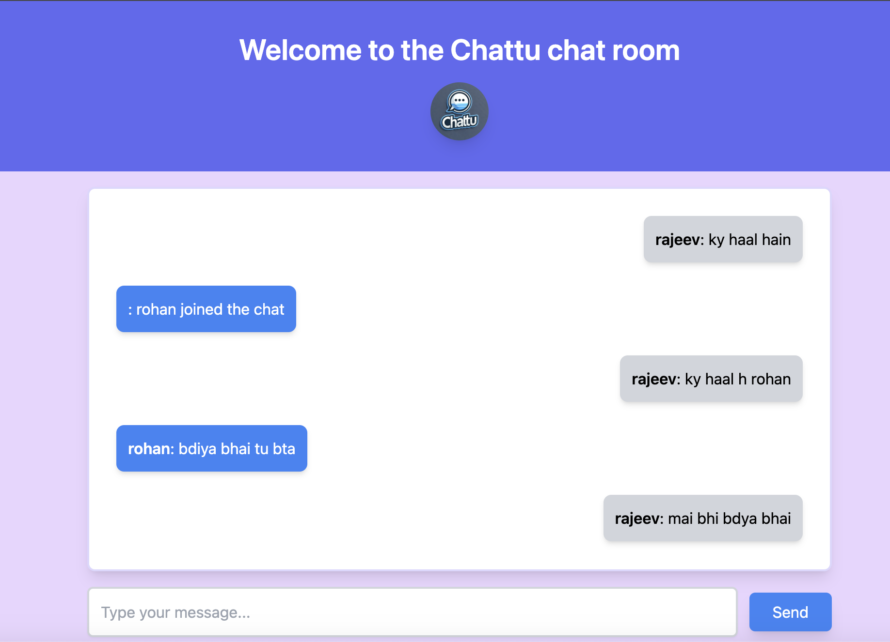

# ChatApp - Chattu

Chattu is a real-time chat application built with **Node.js**, **WebSockets**, and **React**. It allows for two-way communication, enabling users to exchange messages instantly. The app offers a seamless chat experience with a simple interface and smooth performance.




## Features

- **Real-time communication** using WebSockets
- **Instant message delivery** between users
- **Simple and clean UI** built with React
- **No need for page refreshes**: real-time updates via WebSockets
- **Lightweight and fast**: low latency communication
- **Responsive design** that works on both desktop and mobile

## Technologies Used

- **Frontend:** React.js
- **Backend:** Node.js, WebSockets (for real-time communication)
- **Development tools:** Tailwind CSS (for styling)

## Prerequisites

Before running the app, ensure you have the following installed:

- [Node.js](https://nodejs.org/) (with npm)
- [Git](https://git-scm.com/)
- [Web Browser](https://www.google.com/chrome/)

## Installation

### Clone the repository

```bash
git clone https://github.com/Rajeev5842/chattu.git
cd chattu
